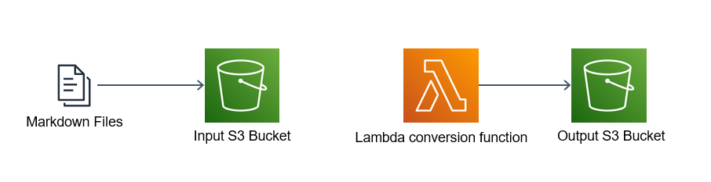
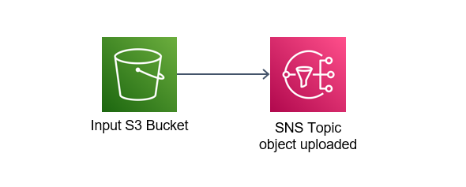
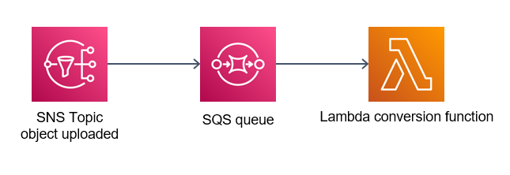
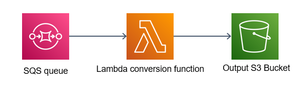
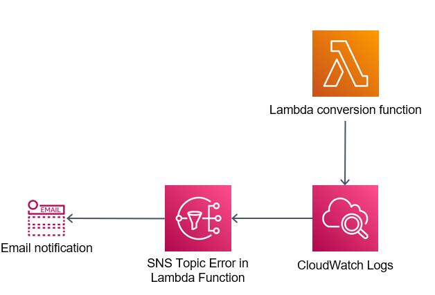

# Implementação

Nessa página da documentação nós vamos entender como o código terraform fora implementado para a construção do projeto.

## Terraform

Terraform é uma ferramenta de infraestrutura como código (IaC) para provisionar e gerenciar recursos de forma automatizada e escalável. Gerenciado pela empresa HashiCorp, o terraform possui integração com diversos providers, incluindo a AWS que será o provider utilizado nesse projeto. Toda a infraestrutura da aplicação está implementada em terraform:


A construção de um componente em terraform é feita da seguinte maneira:
```terraform linenums="1"
resource "provider_instance" "example" {
  name = "name-example"
  ...
}
```

O código Terraform do projeto está localizado em um único arquivo, ```terraform/main.tf```. Neste guia, vamos analisar detalhadamente como cada componente dentro do código está configurado e como cada um deles se interliga com os demais.

#### S3

O Amazon S3 (Simple Storage Service) é um serviço de armazenamento de objetos altamente escalável fornecido pela AWS. Armazena arquivos e oferece alta disponibilidade, escalabilidade automática e recursos de segurança avançados. É amplamente utilizado para armazenamento de dados, backup e hospedagem de sites.

No nosso projeto nós fazemos a utilização de dois buckets S3, um como input de arquivos markdown, e outro como output do função de conversão Lambda, que armazenará os arquivos HTML.




Para a criação desses buckets fora construído o seguinte código:

```terraform linenums="1"
resource "aws_s3_bucket" "input-bucket-cloudconvertr" {
  bucket = "input-bucket-cloudconvertr"
}

resource "aws_s3_bucket" "output-bucket-cloudconvertr" {
  bucket = "output-bucket-cloudconvertr"
}
```

Para que o upload de um novo arquivo consiga realizar o _trigger_ das etapas subsequentes, nós precisamos ser alertados quando a ação de upload seja realizada. Portanto, fora adicionado a parte de código abaixo:

```terraform linenums="1"
resource "aws_s3_bucket_notification" "bucket_notification" {
  bucket = aws_s3_bucket.input-bucket-cloudconvertr.id

  topic {
    topic_arn  = aws_sns_topic.sns-CloudConvertR.arn
    events     = ["s3:ObjectCreated:Put", "s3:ObjectCreated:Post"]
  }
}
```


Observe que na linha '2' fora especificado o bucket que queremos monitorar, e na linha 6 as ações em que esse alerta deve ser disparado, que são as ações de Put e Post. Com isso o nosso bucket já está configurado para ativar os processos seguintes.

```terraform hl_lines="2 6" linenums="1"
resource "aws_s3_bucket_notification" "bucket_notification" {
  bucket = aws_s3_bucket.input-bucket-cloudconvertr.id

  topic {
    topic_arn  = aws_sns_topic.sns-CloudConvertR.arn
    events     = ["s3:ObjectCreated:Put", "s3:ObjectCreated:Post"]
  }
}
```

Com isso, nosso código para a configuração do S3 ficaria assim:

```terraform linenums="1"
resource "aws_s3_bucket" "input-bucket-cloudconvertr" {
  bucket = "input-bucket-cloudconvertr"
}

resource "aws_s3_bucket" "output-bucket-cloudconvertr" {
  bucket = "output-bucket-cloudconvertr"
}

resource "aws_s3_bucket_notification" "bucket_notification" {
  bucket = aws_s3_bucket.input-bucket-cloudconvertr.id

  topic {
    topic_arn  = aws_sns_topic.sns-CloudConvertR.arn
    events     = ["s3:ObjectCreated:Put", "s3:ObjectCreated:Post"]
  }
}
```

#### SNS

O Amazon Simple Notification Service (Amazon SNS) é um serviço gerenciado que fornece entrega de mensagens de editores para assinantes (também conhecido comoProdutoreseConsumidores). Os editores se comunicam de maneira assíncrona com os assinantes produzindo e enviando mensagens para um tópico, que é um canal de comunicação e um ponto de acesso lógico. Os clientes podem se inscrever no tópico SNS e receber mensagens publicadas usando um tipo de endpoint compatível, como Amazon Kinesis Data Firehose, Amazon SQS,AWS Lambda, HTTP, e-mail, notificações push móveis e mensagens de texto móveis (SMS).

Para a construção do SNS, fora preciso a construção de uma policy. Uma policy é uma série de configurações que permite fornecer acessos a componentes de maneira regrada. Para o caso do SNS, sua policy permite que a notificação de upload do bucket S3 de input, possa escrever no tópico do SNS.



No código abaixo podemos ver a policy criada. Nas linhas '10' e '11' podemos ver a ação permitida ("SNS:Publish" -> ação de publicar menssagem no tópico SNS) e a qual recurso estamos permitindo essa ação seja feita ("sns-CloudConvertR" -> Tópico SNS que está conectando o nosso bucket de input ao SQS).

```terraform hl_lines="10 11" linenums="1"
data "aws_iam_policy_document" "topic" {
  statement {
    effect = "Allow"

    principals {
      type        = "Service"
      identifiers = ["s3.amazonaws.com"]
    }

    actions   = ["SNS:Publish"]
    resources = ["arn:aws:sns:*:*:sns-CloudConvertR"]

    condition {
      test     = "ArnLike"
      variable = "aws:SourceArn"
      values   = [aws_s3_bucket.input-bucket-cloudconvertr.arn]
    }
  }
}
```

Observer que a policy possui um campo de "condition", o que demonstra que essa ação só pode ser performada caso a condição seja satisfeita. Nessa caso a condição está restringindo os elementos que podem realizar essa ação, no caso desse projeto, ao bucket de input de arquivos

```terraform hl_lines="16" linenums="1"
data "aws_iam_policy_document" "topic" {
  statement {
    effect = "Allow"

    principals {
      type        = "Service"
      identifiers = ["s3.amazonaws.com"]
    }

    actions   = ["SNS:Publish"]
    resources = ["arn:aws:sns:*:*:sns-CloudConvertR"]

    condition {
      test     = "ArnLike"
      variable = "aws:SourceArn"
      values   = [aws_s3_bucket.input-bucket-cloudconvertr.arn]
    }
  }
}
```

Com a policy criada podemos criar o nosso tópico SNS e integrar essas permissões a sua policy:

```terraform linenums="1"
resource "aws_sns_topic" "sns-CloudConvertR" {
  name   = "sns-CloudConvertR"
  policy = data.aws_iam_policy_document.topic.json
}
```

Outra funcionalidade implementada foi a notificação por email quando um arquivo novo é inserido no projeto. Para que essa informação consiga chegar ao email, é necessário inscrever o email nesse tópico SNS. Para isso fora implementado o código abaixo:
```terraform linenums="1"
variable "email" {
  type = string
}

resource "aws_sns_topic_subscription" "email_notification" {
  topic_arn = aws_sns_topic.sns-CloudConvertR.arn
  protocol  = "email"
  endpoint  = var.email
}
```

Com isso nosso código para configuração do SNS fica assim:

```terraform linenums="1"
data "aws_iam_policy_document" "topic" {
  statement {
    effect = "Allow"

    principals {
      type        = "Service"
      identifiers = ["s3.amazonaws.com"]
    }

    actions   = ["SNS:Publish"]
    resources = ["arn:aws:sns:*:*:sns-CloudConvertR"]

    condition {
      test     = "ArnLike"
      variable = "aws:SourceArn"
      values   = [aws_s3_bucket.input-bucket-cloudconvertr.arn]
    }
  }
}

resource "aws_sns_topic" "sns-CloudConvertR" {
  name   = "sns-CloudConvertR"
  policy = data.aws_iam_policy_document.topic.json
}

variable "email" {
  type = string
}

resource "aws_sns_topic_subscription" "email_notification" {
  topic_arn = aws_sns_topic.sns-CloudConvertR.arn
  protocol  = "email"
  endpoint  = var.email
}
```

#### SQS

O Amazon Simple Queue Service (SQS) permite que você envie, armazene e receba mensagens entre componentes de software em qualquer volume, sem perder mensagens ou precisar que outros serviços estejam disponíveis.

Nesse projeto o SQS está responsável por receber as novas notificações do tópico SNS e repassá-las para a função Lambda.



Para a criação da fila SQS fora implementado o seguinte código:

```terraform linenums="1"
resource "aws_sqs_queue" "sqs-CloudConvertR" {
  name = "sqs-CloudConvertR"
}
```

Também fora implementado uma policy para permitir que o tópico SNS conseguisse enviar mensagens para a fila SQS. Nas linhas '11' e '12' está especificado a ação permitida e o recurso para o qual essa ação pode ser aplicada, respectivamente. Na linha '17' podemos verificar o recurso a quem essas permissões estão sendo fornecidas, no caso do nosso projeto, o recurso é o tópico SNS.

```terraform hl_lines="11 12 17" linenums="1"
data "aws_iam_policy_document" "sqs-policy" {
  statement {
    sid    = "First"
    effect = "Allow"

    principals {
      type        = "*"
      identifiers = ["*"]
    }

    actions   = ["sqs:SendMessage"]
    resources = [aws_sqs_queue.sqs-CloudConvertR.arn]

    condition {
      test     = "ArnEquals"
      variable = "aws:SourceArn"
      values   = [aws_sns_topic.sns-CloudConvertR.arn]
    }
  }
}
```

Para adicionar a policy ao SQS:
```terraform linenums="1"
resource "aws_sqs_queue_policy" "sqs-policy" {
  queue_url = aws_sqs_queue.sqs-CloudConvertR.id
  policy    = data.aws_iam_policy_document.sqs-policy.json
}
```
Com a permissão de receber mensagens do tópico SNS fornecida, precisamos inscrever a fila SQS no próprio tópico (um recurso só receberá as mensagens do SNS caso esteja inscrito no mesmo). Para isso é necessário implementar:
```terraform linenums="1"
resource "aws_sns_topic_subscription" "sqs_notification" {
  topic_arn = aws_sns_topic.sns-CloudConvertR.arn
  protocol  = "sqs"
  endpoint  = aws_sqs_queue.sqs-CloudConvertR.arn
}
```
Com isso, nosso código para a construção do SQS ficará assim:

```terraform linenums="1"

resource "aws_sqs_queue" "sqs-CloudConvertR" {
  name = "sqs-CloudConvertR"
}

data "aws_iam_policy_document" "sqs-policy" {
  statement {
    sid    = "First"
    effect = "Allow"

    principals {
      type        = "*"
      identifiers = ["*"]
    }

    actions   = ["sqs:SendMessage"]
    resources = [aws_sqs_queue.sqs-CloudConvertR.arn]

    condition {
      test     = "ArnEquals"
      variable = "aws:SourceArn"
      values   = [aws_sns_topic.sns-CloudConvertR.arn]
    }
  }
}

resource "aws_sqs_queue_policy" "sqs-policy" {
  queue_url = aws_sqs_queue.sqs-CloudConvertR.id
  policy    = data.aws_iam_policy_document.sqs-policy.json
}

resource "aws_sns_topic_subscription" "sqs_notification" {
  topic_arn = aws_sns_topic.sns-CloudConvertR.arn
  protocol  = "sqs"
  endpoint  = aws_sqs_queue.sqs-CloudConvertR.arn
}
```


#### Lambda Function

O AWS Lambda é um serviço de computação sem servidor e orientado a eventos que permite executar código para praticamente qualquer tipo de aplicação ou serviço de backend sem provisionar ou gerenciar servidores.

A função Lambda, dentro do nosso projeto, tem a funcionalidade de realizar a conversão dos arquivos em markdown para HTML. Ela receberá uma mensagem vinda do SQS que conterá, no seu corpo da mensagem, o nome do arquivo que foi realizado o upload e o nome do bucket proveniente. Posteriormente analisaremos detalhadamente o código implementado em Python para realizar essa conversão.



Para a criação da função Lambda foi necessário configurar algumas políticas de acesso como receber os arquivos via fila SQS, acesso ao manuseio de arquivos do S3 e permissões básicas de execução para a função. No código abaixo está representado a política da função e cada uma das roles que possibilitam as ações listadas acima. A diferença entre funções IAM (Roles) e políticas (Policies) na AWS é que uma função é um tipo de identidade IAM que pode ser autenticada e autorizada a utilizar um recurso da AWS, enquanto uma política define as permissões da identidade IAM.

```terraform linenums="1"
data "aws_iam_policy_document" "lambda_policy" {
  statement {
    effect = "Allow"
    actions = ["sts:AssumeRole"]
    principals {
      type        = "Service"
      identifiers = ["lambda.amazonaws.com"]
    }
  }
}

resource "aws_iam_role" "lambda_role" {
  name               = "lambda_role"
  assume_role_policy = data.aws_iam_policy_document.lambda_policy.json
}

resource "aws_iam_role_policy_attachment" "lambda_sqs_role_policy" {
  role       = aws_iam_role.lambda_role.name
  policy_arn = "arn:aws:iam::aws:policy/service-role/AWSLambdaSQSQueueExecutionRole"
}

resource "aws_iam_role_policy_attachment" "lambda_s3_role_policy" {
  role       = aws_iam_role.lambda_role.name
  policy_arn = "arn:aws:iam::aws:policy/AmazonS3FullAccess"
}

resource "aws_iam_role_policy_attachment" "lambda_basic_execution_role_policy" {
  role       = aws_iam_role.lambda_role.name
  policy_arn = "arn:aws:iam::aws:policy/service-role/AWSLambdaBasicExecutionRole"
}
```

Para a criação da porópria função Lambda foi preciso criar uma pasta zipada com o código em python que performará a conversão dos arquivos. Para realizar a ação de zipar a pasta temos o código abaixo:
```terraform linenums="1"
data "archive_file" "zip_python_code" {
  type = "zip"
  source_dir  = "${path.module}/python/"
  output_path = "${path.module}/python/lambda-CloudConvertR.zip"
}
```
Com o código zipado podemos criar a nossa função Lambda. Vamos análisar cada uma das variáveis da criação da Lambda para melhor entendermos o processo. O "filename" é o nome do arquivo .zip que queremos realizar o upload. O "function_name" é o nome da nossa função Lambda, é como veremos ela na interface da AWS. O "role" são as permissões que definimos anteriormente. O "handler" é muito importante e é precisocuidado na sua especificação; ele segue o seguuinte padrão: <nome_do_arquivo.py>.<nome_da_função_dentro_do_arquivo>, portanto certifique-se de que esses nomes estão condizentes. O "runtime" é o ambiente em que sua aplicação irá rodar, no caso desse projeto é o python. Com isso temos o seguinte código:  
```terraform linenums="1"
resource "aws_lambda_function" "lambda-test-cp" {
  filename      = "${path.module}/python/lambda-CloudConvertR.zip"
  function_name = "lambda-CloudConvertR"
  role          = aws_iam_role.lambda_role.arn
  handler       = "lambda-CloudConvertR.CloudConvertR"   # <nome_do_arquivo.py>.<nome_da_função_dentro_do_arquivo>
  runtime       = "python3.8"
}
```

Nossa função faz uso da biblioteca "markdown", que é uma biblioteca especifica e não nativa do python para realizar a conversão dos arquivos, portanto, é preciso criar uma layer que conterá os requerimentos dessa biblioteca. É preciso também que todos esses requerimentos estejam em uma pasta .zip, então foi rodado o seguinte comando para a criação da pasta:

```bash
$ pip install markdown -t layer/python/lib/python3.8/site-packages/
```

E para a subida dessa layer via terraform temos:
```terraform linenums="1"
resource "aws_lambda_layer_version" "lambda_layer_payload" {
  filename   = "${path.module}/python/python.zip"
  layer_name = "markdown"
}
```
Nossa Lambda está pronta, mas falta conecta-lá com o SQS. É preciso mapear o evento de chegada de novos items na fila SQS e toda vez que um elemento novo chegar a Lambda deve ser executada. Para isso montamos o código abaixo. Observe que na linha 2 fora especificado o recurso SQS que críamos anteriormente:
```terraform hl_lines="2" linenums="1"
resource "aws_lambda_event_source_mapping" "event_source_mapping" {
  event_source_arn = aws_sqs_queue.sqs-CloudConvertR.arn
  function_name    = aws_lambda_function.lambda-test-cp.arn
}
```

Por fim, nosso código para a criação da Lambda ficou assim:
```terraform linenums="1"
data "aws_iam_policy_document" "lambda_policy" {
  statement {
    effect = "Allow"
    actions = ["sts:AssumeRole"]
    principals {
      type        = "Service"
      identifiers = ["lambda.amazonaws.com"]
    }
  }
}

resource "aws_iam_role" "lambda_role" {
  name               = "lambda_role"
  assume_role_policy = data.aws_iam_policy_document.lambda_policy.json
}

resource "aws_iam_role_policy_attachment" "lambda_sqs_role_policy" {
  role       = aws_iam_role.lambda_role.name
  policy_arn = "arn:aws:iam::aws:policy/service-role/AWSLambdaSQSQueueExecutionRole"
}

resource "aws_iam_role_policy_attachment" "lambda_s3_role_policy" {
  role       = aws_iam_role.lambda_role.name
  policy_arn = "arn:aws:iam::aws:policy/AmazonS3FullAccess"
}

resource "aws_iam_role_policy_attachment" "lambda_basic_execution_role_policy" {
  role       = aws_iam_role.lambda_role.name
  policy_arn = "arn:aws:iam::aws:policy/service-role/AWSLambdaBasicExecutionRole"
}


data "archive_file" "zip_python_code" {
  type = "zip"
  source_dir  = "${path.module}/python/"
  output_path = "${path.module}/python/lambda-CloudConvertR.zip"
}

resource "aws_lambda_function" "lambda-test-cp" {
  filename      = "${path.module}/python/lambda-CloudConvertR.zip"
  function_name = "lambda-CloudConvertR"
  role          = aws_iam_role.lambda_role.arn
  handler       = "lambda-CloudConvertR.CloudConvertR"   # <nome_do_arquivo.py>.<nome_da_função_dentro_do_arquivo>
  runtime       = "python3.8"
}

resource "aws_lambda_event_source_mapping" "event_source_mapping" {
  event_source_arn = aws_sqs_queue.sqs-CloudConvertR.arn
  function_name    = aws_lambda_function.lambda-test-cp.arn
}

resource "aws_lambda_layer_version" "lambda_layer_payload" {
  filename   = "${path.module}/python/python.zip"
  layer_name = "markdown"
}
```


#### CloudWatch
O Amazon CloudWatch coleta e visualiza logs, métricas e dados de eventos em tempo reale nós vamos utilizá-lo para verificar possíveis erros de execução da função Lambda.



O código para a criação do CloudWatch foi implementado da seguinte maneira:
```terraform linenums="1"
resource "aws_cloudwatch_metric_alarm" "cloudwatch-CloudConvertR" {
  alarm_name                = "cloudwatch-CloudConvertR"
  comparison_operator       = "GreaterThanThreshold"
  evaluation_periods        = 1
  metric_name               = "Errors"
  namespace                 = "AWS/Lambda"
  period                    = 60
  statistic                 = "Sum"
  threshold                 = 0
  alarm_description         = "This metric monitors Lambda function errors"
  alarm_actions             = [aws_sns_topic.sns-cloudwatch-CloudConvertR.arn]
  insufficient_data_actions = []
  dimensions = {
    FunctionName = aws_lambda_function.lambda-CloudConvertR.id
  }
}
```

O objetivo do CloudWatch é identificar todos erros "evento" (*metric_name*) e sinalizar quando cada um deles acontecer. Para isso fora escolhida a métrica de "soma" (_statistic_) e o "limite" (_threshold_) de 0, assim toda vez que um erro acontecer (a soma será maior que 0) o CloudWatch entrará em estado de alerta.
```terraform hl_lines="5 7 8" linenums="1"
resource "aws_cloudwatch_metric_alarm" "cloudwatch-CloudConvertR" {
  alarm_name                = "cloudwatch-CloudConvertR"
  comparison_operator       = "GreaterThanThreshold"
  evaluation_periods        = 1
  metric_name               = "Errors"
  namespace                 = "AWS/Lambda"
  period                    = 60
  statistic                 = "Sum"
  threshold                 = 0
  alarm_description         = "This metric monitors Lambda function errors"
  alarm_actions             = [aws_sns_topic.sns-cloudwatch-CloudConvertR.arn]
  insufficient_data_actions = []
  dimensions = {
    FunctionName = aws_lambda_function.lambda-CloudConvertR.id
  }
}
```

É preciso também definir um recurso para observar quando o CloudWatch entra em estado de alerta, para isso nós estamos utilizando um tópico SNS (*alarm_actions*). Toda vez que estiver um erro na função, uma nova mensagem aparecerá no tópico SNS.
```terraform hl_lines="11" linenums="1"
resource "aws_cloudwatch_metric_alarm" "cloudwatch-CloudConvertR" {
  alarm_name                = "cloudwatch-CloudConvertR"
  comparison_operator       = "GreaterThanThreshold"
  evaluation_periods        = 1
  metric_name               = "Errors"
  namespace                 = "AWS/Lambda"
  period                    = 60
  statistic                 = "Sum"
  threshold                 = 0
  alarm_description         = "This metric monitors Lambda function errors"
  alarm_actions             = [aws_sns_topic.sns-cloudwatch-CloudConvertR.arn]
  insufficient_data_actions = []
  dimensions = {
    FunctionName = aws_lambda_function.lambda-CloudConvertR.id
  }
}
```

É preciso também definir um recurso para observar quando o CloudWatch entra em estado de alerta, para isso nós estamos utilizando um tópico SNS (*alarm_actions*). Toda vez que estiver um erro na função, uma nova mensagem aparecerá no tópico SNS.
```terraform hl_lines="11" linenums="1"
resource "aws_cloudwatch_metric_alarm" "cloudwatch-CloudConvertR" {
  alarm_name                = "cloudwatch-CloudConvertR"
  comparison_operator       = "GreaterThanThreshold"
  evaluation_periods        = 1
  metric_name               = "Errors"
  namespace                 = "AWS/Lambda"
  period                    = 60
  statistic                 = "Sum"
  threshold                 = 0
  alarm_description         = "This metric monitors Lambda function errors"
  alarm_actions             = [aws_sns_topic.sns-cloudwatch-CloudConvertR.arn]
  insufficient_data_actions = []
  dimensions = {
    FunctionName = aws_lambda_function.lambda-CloudConvertR.id
  }
}
```
Outra variável importante é o recurso que o CloudWatch irá monitorar, no nosso caso é uma função Lambda. Portanto, para definir isso é preciso colocar o nome da função dentro da variável _dimensions_ como mostrado no código abaixo:
```terraform hl_lines="13-15" linenums="1"
resource "aws_cloudwatch_metric_alarm" "cloudwatch-CloudConvertR" {
  alarm_name                = "cloudwatch-CloudConvertR"
  comparison_operator       = "GreaterThanThreshold"
  evaluation_periods        = 1
  metric_name               = "Errors"
  namespace                 = "AWS/Lambda"
  period                    = 60
  statistic                 = "Sum"
  threshold                 = 0
  alarm_description         = "This metric monitors Lambda function errors"
  alarm_actions             = [aws_sns_topic.sns-cloudwatch-CloudConvertR.arn]
  insufficient_data_actions = []
  dimensions = {
    FunctionName = aws_lambda_function.lambda-CloudConvertR.id
  }
}
```

Vamos agora criar o tópico SNS que receberá as notificações do CloudWatch e subscrever um email no mesmo para que sejamos notificados toda vez que um erro ocorrer. Lembre-se de configurar a policy para permitir que o CloudWatch tenha permissões para criar novas mensagens no tópico, igual fizemos com o tópico SNS anterior, em que configuramos uma permissão para os eventos de upload no S3 pudessem escrever mensagens no tópico.
```terraform hl_lines="10-11 14-15 20" linenums="1"
resource "aws_sns_topic" "sns-cloudwatch-CloudConvertR" {
  name   = "sns-cloudwatch-CloudConvertR"
}

data "aws_iam_policy_document" "sns-cloudwatch-policy" {
  statement {
    effect = "Allow"

    principals {
      type        = "Service"
      identifiers = ["cloudwatch.amazonaws.com"]
    }

    actions   = ["SNS:Publish"]
    resources = ["arn:aws:sns:*:*:sns-cloudwatch-CloudConvertR"]

    condition {
      test     = "ArnLike"
      variable = "aws:SourceArn"
      values   = [aws_cloudwatch_metric_alarm.cloudwatch-CloudConvertR.arn]
    }
  }
}

resource "aws_sns_topic_policy" "default" {
  arn = aws_sns_topic.sns-cloudwatch-CloudConvertR.arn
  policy = data.aws_iam_policy_document.sns-cloudwatch-policy.json
}
```
Para inscrever um email no tópico SNS basta implementar o código abaixo:
```terraform linenums="1"
variable "email" {
  type = string
}

resource "aws_sns_topic_subscription" "lambda_errors_email_notification" {
  topic_arn = aws_sns_topic.sns-cloudwatch-CloudConvertR.arn
  protocol  = "email"
  endpoint  = var.email
}
```

Com isso, nosso código final para a criação do CloudWatch ficou da seguinte maneira:
```terraform linenums="1"
resource "aws_sns_topic" "sns-cloudwatch-CloudConvertR" {
  name   = "sns-cloudwatch-CloudConvertR"
}

resource "aws_cloudwatch_metric_alarm" "cloudwatch-CloudConvertR" {
  alarm_name                = "cloudwatch-CloudConvertR"
  comparison_operator       = "GreaterThanThreshold"
  evaluation_periods        = 1
  metric_name               = "Errors"
  namespace                 = "AWS/Lambda"
  period                    = 60
  statistic                 = "Sum"
  threshold                 = 0
  alarm_description         = "This metric monitors Lambda function errors"
  alarm_actions             = [aws_sns_topic.sns-cloudwatch-CloudConvertR.arn]
  insufficient_data_actions = []
  dimensions = {
    FunctionName = aws_lambda_function.lambda-CloudConvertR.id
  }
}


data "aws_iam_policy_document" "sns-cloudwatch-policy" {
  statement {
    effect = "Allow"

    principals {
      type        = "Service"
      identifiers = ["cloudwatch.amazonaws.com"]
    }

    actions   = ["SNS:Publish"]
    resources = ["arn:aws:sns:*:*:sns-cloudwatch-CloudConvertR"]

    condition {
      test     = "ArnLike"
      variable = "aws:SourceArn"
      values   = [aws_cloudwatch_metric_alarm.cloudwatch-CloudConvertR.arn]
    }
  }
}

resource "aws_sns_topic_policy" "default" {
  arn = aws_sns_topic.sns-cloudwatch-CloudConvertR.arn
  policy = data.aws_iam_policy_document.sns-cloudwatch-policy.json
}

variable "email" {
  type = string
}

resource "aws_sns_topic_subscription" "lambda_errors_email_notification" {
  topic_arn = aws_sns_topic.sns-cloudwatch-CloudConvertR.arn
  protocol  = "email"
  endpoint  = var.email
}
```


## Python

Nosso código Python é responsável por pegar o arquivo novo no bucket de input, transformá-lo em HTML e colocá-lo no bucket de output. Vamos ver passo a passo como podemos fazer isso.

Nosso códiga utilizará 3 bibliotecas.

* json: Para decodificação da mensagem do SQS;
* boto3: Para realizar a leitura e escrita de arquivos nos bucket de input e output;
* markdown: Biblioteca para conversão de arquivos markdown para HTML (essa biblioteca não é nativa e, como explicado anteriormente no tópico de Lambda, foi colocada dentro da Layer)

Nossa função tem como input o evento gerado (mensagem SQS) e o contexto (não iremos utilizar esse argumento na função). Vamos então criar nossão função com esses conceitos iniciais em mente, com isso temos:

``` py
import json
import boto3
import markdown

def CloudConvertR(event, context):
  client = boto3.client('s3') # (1)!
```

1.  Criação do *client* que realizará a leitura e escrita nos buckets S3.

Ao receber a mensagem via SQS de que um novo arquivo foi adicionado no bucket, o python decodifica a mensagem em busca do nome do arquivo novo e do bucket de input. Isso pode ser visto nas linhas 13 e 14:
``` py hl_lines="13-14" linenums="1"
import json
import boto3
import markdown

def CloudConvertR(event, context):
    client = boto3.client('s3')
    
    body = json.loads(event['Records'][0]['body'])
    message = json.loads(body["Message"])
    s3 = message['Records'][0]['s3']
    
    # Source S3 bucket
    source_bucket_name = s3["bucket"]["name"]
    object_key = s3["object"]["key"]
```

Podemos ainda definir as variáveis de output. O bucket de output é sempre o mesmo e o nome do arquivo de saída é o mesmo do arquivo de entrada mudando apenas sua extensão para HTML:


``` py hl_lines="17-18" linenums="1"
import json
import boto3
import markdown

def CloudConvertR(event, context):
    client = boto3.client('s3')
    
    body = json.loads(event['Records'][0]['body'])
    message = json.loads(body["Message"])
    s3 = message['Records'][0]['s3']
    
    # Source S3 bucket
    source_bucket_name = s3["bucket"]["name"]
    object_key = s3["object"]["key"]

    # Destination S3 bucket
    destination_bucket_name = 'output-bucket-cloudconvertr'
    destination_object_key = f"{object_key.split('.')[0]}.html"
    
    print(f"S3 bucket = {source_bucket_name}\nFile uploaded = {object_key}")
```

Com essas variáveis em mãos já podemos iniciar a leitura e escrita dos arquivos. Para leitura vamos utilizar a função `get_object()` do boto3:

``` py hl_lines="23" linenums="1"
import json
import boto3
import markdown

def CloudConvertR(event, context):
    client = boto3.client('s3')
    
    body = json.loads(event['Records'][0]['body'])
    message = json.loads(body["Message"])
    s3 = message['Records'][0]['s3']
    
    # Source S3 bucket
    source_bucket_name = s3["bucket"]["name"]
    object_key = s3["object"]["key"]

    # Destination S3 bucket
    destination_bucket_name = 'output-bucket-cloudconvertr'
    destination_object_key = f"{object_key.split('.')[0]}.html"
    
    print(f"S3 bucket = {source_bucket_name}\nFile uploaded = {object_key}")

    # Reading de markdown file
    response = client.get_object(Bucket=source_bucket_name, Key=object_key)
    data = response['Body'].read() # (1)!
    md = data.decode('utf-8')
```

1.  A função `get_object()` retorna uma string de bytes, portanto, devemos decodificar ela para realizar a conversão.


Para realizar a conversão vamos utilizar a biblioteca "markdown":
``` py hl_lines="28" linenums="1"
import json
import boto3
import markdown

def CloudConvertR(event, context):
    client = boto3.client('s3')
    
    body = json.loads(event['Records'][0]['body'])
    message = json.loads(body["Message"])
    s3 = message['Records'][0]['s3']
    
    # Source S3 bucket
    source_bucket_name = s3["bucket"]["name"]
    object_key = s3["object"]["key"]

    # Destination S3 bucket
    destination_bucket_name = 'output-bucket-cloudconvertr'
    destination_object_key = f"{object_key.split('.')[0]}.html"
    
    print(f"S3 bucket = {source_bucket_name}\nFile uploaded = {object_key}")

    # Reading de markdown file
    response = client.get_object(Bucket=source_bucket_name, Key=object_key)
    data = response['Body'].read() 
    md = data.decode('utf-8')

    # Converting it to html
    html = markdown.markdown(md)
```
Pronto, agora temos o arquivo em HTML. Só precisamos colocá-lo no bucket de output, e para isso utilizaremos uma função da biblioteca boto3 chamada `put_object()`:
``` py hl_lines="31" linenums="1"
import json
import boto3
import markdown

def CloudConvertR(event, context):
    client = boto3.client('s3')
    
    body = json.loads(event['Records'][0]['body'])
    message = json.loads(body["Message"])
    s3 = message['Records'][0]['s3']
    
    # Source S3 bucket
    source_bucket_name = s3["bucket"]["name"]
    object_key = s3["object"]["key"]

    # Destination S3 bucket
    destination_bucket_name = 'output-bucket-cloudconvertr'
    destination_object_key = f"{object_key.split('.')[0]}.html"
    
    print(f"S3 bucket = {source_bucket_name}\nFile uploaded = {object_key}")

    # Reading de markdown file
    response = client.get_object(Bucket=source_bucket_name, Key=object_key)
    data = response['Body'].read()
    md = data.decode('utf-8')

    # Converting it to html
    html = markdown.markdown(md)

    # Storing the html file in the output bucket
    client.put_object(Body=html, Bucket=destination_bucket_name, Key=destination_object_key, ContentType='text/html')
```

Por fim vamos retornar o status_code 200 para a nossa Lambda para que ela saiba que tudo ocorreu da maneira correta. Com isso, nosso código final ficou da seguinte maneira:

``` py linenums="1"
import json
import boto3
import markdown

def CloudConvertR(event, context):
    client = boto3.client('s3')
    
    body = json.loads(event['Records'][0]['body'])
    message = json.loads(body["Message"])
    s3 = message['Records'][0]['s3']
    
    # Source S3 bucket
    source_bucket_name = s3["bucket"]["name"]
    object_key = s3["object"]["key"]

    # Destination S3 bucket
    destination_bucket_name = 'output-bucket-cloudconvertr'
    destination_object_key = f"{object_key.split('.')[0]}.html"
    
    print(f"S3 bucket = {source_bucket_name}\nFile uploaded = {object_key}")

    # Reading de markdown file
    response = client.get_object(Bucket=source_bucket_name, Key=object_key)
    data = response['Body'].read()
    md = data.decode('utf-8')

    # Converting it to html
    html = markdown.markdown(md)

    # Storing the html file in the output bucket
    client.put_object(Body=html, Bucket=destination_bucket_name, Key=destination_object_key, ContentType='text/html')

    return {
        'statusCode': 200,
    }
```
