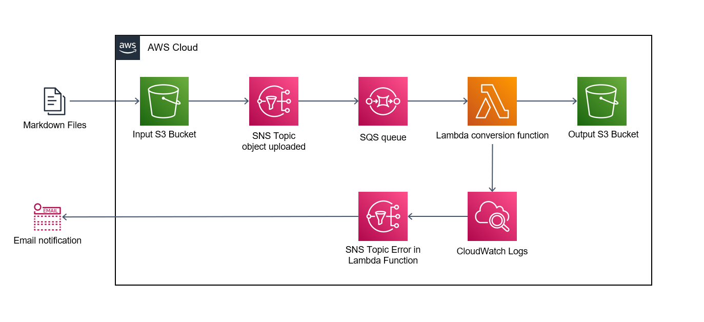

# Infraestrutura

## Introdução

Neste documento, forneceremos uma visão geral da infraestrutura do projeto construído na AWS (Amazon Web Services) e destacaremos as principais ferramentas utilizadas, incluindo o Bucket S3, SNS, SQS, Lambda function e CloudWatch. A AWS oferece uma ampla gama de serviços em nuvem altamente confiáveis e escaláveis, permitindo que o projeto aproveite ao máximo essas ferramentas para atender aos requisitos de armazenamento, comunicação, processamento e monitoramento.

O Bucket S3 é um serviço de armazenamento de objetos altamente durável e escalável, que fornece a capacidade de armazenar e recuperar quantidades massivas de dados de forma segura. Ele será utilizado para armazenar e gerenciar os dados do projeto, garantindo alta disponibilidade e durabilidade dos arquivos.

O SNS (Simple Notification Service) será utilizado para fornecer uma comunicação assíncrona e confiável entre os componentes do projeto. Ele permite o envio de notificações e mensagens para diferentes destinos, como aplicativos, serviços de e-mail e mensagens de texto, garantindo uma comunicação eficiente e confiável entre os sistemas envolvidos.

O SQS (Simple Queue Service) é um serviço de fila de mensagens que será usado para o processamento de mensagens assíncronas entre os componentes do projeto. Ele garante a entrega e a ordem correta das mensagens, permitindo que as diferentes partes do sistema se comuniquem de maneira assíncrona e resiliente.

As funções do Lambda serão aproveitadas para executar código de forma serverless. Com o Lambda, é possível executar código em resposta a eventos, sem a necessidade de provisionar ou gerenciar servidores. Essa abordagem oferece escalabilidade automática e alta disponibilidade para as operações do projeto.

O CloudWatch é uma ferramenta de monitoramento e observabilidade da AWS. Ele permite acompanhar e coletar métricas, logs e eventos de diferentes serviços da AWS, incluindo os recursos utilizados pelo projeto. O CloudWatch será utilizado para monitorar o desempenho, o estado dos recursos e configurar alarmes para notificar possíveis problemas.

Ao longo deste documento, detalharemos como essas ferramentas estão integradas na arquitetura do projeto, explicando como cada uma contribui para a operação eficiente e confiável da infraestrutura na nuvem da AWS.

## Diagrama da Infraestrutura

A figura abaixo mostra o diagrama de toda a infraestrutura e como os componentes dentro da nuvem se comunicam.

Toda a construção da infraestrutura fora implementada utilizando terraform. Terraform é uma ferramenta de código aberto desenvolvida pela HashiCorp que permite automatizar a criação, configuração e gerenciamento de infraestrutura de forma declarativa. Em termos simples, terraform é usado para provisionar e configurar recursos de computação, como servidores, redes, bancos de dados e outros, em diferentes provedores de nuvem, como AWS, Azure, Google Cloud, entre outros.

A interação do usuário se da por meio de duas menairas. A primeira delas é pelo upload do arquivo markdown para o bucket S3 de input, a segunda é o recebimento de emails caso a função Lambda não consiga executar a função.