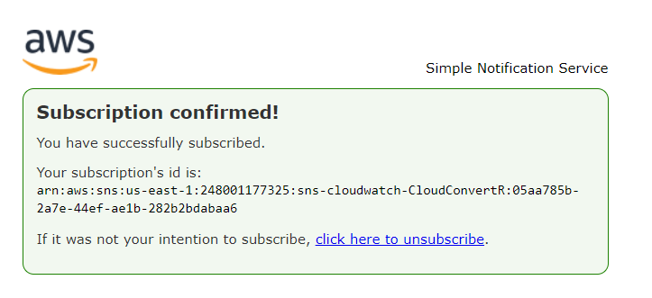

# Utilização 

A seguir, mostraremos como configurar a infraestrutura na AWS e como usá-la.

Abra o terminal e vá para a pasta "terraform", onde você clonou o repositório:

```bash
$ CloudConvertR> cd terraform
$ CloudConvertR\terraform>
```

Dentro da pasta terraform nós iremos rodar o camndo "terraform init". Esse comando é usado para inicializar um diretório de trabalho do Terraform. Ele é executado uma única vez e é responsável por baixar as dependências necessárias e inicializar o backend, que é onde ele armazena os estados da nossa aplicação afim de comparar a nossa infraestrtura local com a infraestrutura na nuvem, para que o mesmo consiga realizar as criações, modificações e deletar recursos.

```bash
$ terraform init
Initializing the backend...

Initializing provider plugins...
- Reusing previous version of hashicorp/aws from the dependency lock file
- Reusing previous version of hashicorp/archive from the dependency lock file
- Using previously-installed hashicorp/archive v2.3.0
- Using previously-installed hashicorp/aws v4.67.0

Terraform has been successfully initialized!

You may now begin working with Terraform. Try running "terraform plan" to see
any changes that are required for your infrastructure. All Terraform commands
should now work.

If you ever set or change modules or backend configuration for Terraform,
rerun this command to reinitialize your working directory. If you forget, other
commands will detect it and remind you to do so if necessary.
```

Feito isso é necessário colocar nossas credenciais de acesso. Para isso vamos rodar o seguinte comando que transforma as chaves em variavéis de ambiente:

Linux
```bash
$ export AWS_ACCESS_KEY_ID=<your_access_key>
$ export AWS_SECRET_ACCESS_KEY=<your_secret_key>
```

Windows
```bash
$ set AWS_ACCESS_KEY_ID=<your_access_key>
$ set AWS_SECRET_ACCESS_KEY=<your_secret_key>
```

Com isso já estamos pronto para construirmos nosso projeto na nuvem. Para verificar os componentes que serão criados e verificar possíveis erro rode o comando:
```bash
$ terraform plan
```

Com tudo configurado vamos rodar o comando para iniciar a construção:
```bash
$ terraform apply
```

Ao executar esse comando, uma variável de email será pedida. Isso foi feito para que o usuário escolhesse o email a qual deseja receber as notificações da função lambda:
```bash
$ terraform apply
var.email
  Enter a value:<your_email>
```

Novamente o terraform mostrará os recursos que serão criados e perguntará se você deseja prosseguir com a construção. Digite "yes".
Se tudo foi criado corretamente você deverá receber a mensagem:
```bash
Apply complete! Resources: 18 added, 0 changed, 0 destroyed.
```
Não esqueça de aceitar a inscrição no tópico SNS via email:



Pronto!
O projeto está implementado na nuvem e pronto para a sua utilização.
Abaixo você pode ver um vídeo de exemplo da utilização do CloudConvertR:


Para destruir os recursos envolvidos com o projeto ne nuvem basta executar o comando:
```bash
$ terraform destroy
```